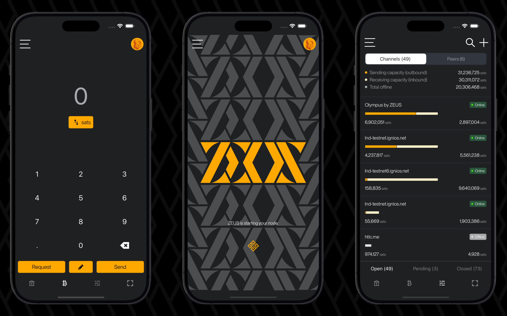

# About ZEUS

ZEUS is a mobile Bitcoin wallet and node management app with full functionalities of a bitcoin lightning wallet that makes bitcoin payments simple, gives users complete control of their finances, and allows more advanced users to manage their Lightning nodes from the palm of their hand.

ZEUS is available to download on [Google Play](https://play.google.com/store/apps/details?id=app.zeusln.zeus), [Apple App Store](https://apps.apple.com/us/app/zeus-ln/id1456038895), and [F-Droid](https://zeusln.app/download/).

If you are having trouble using ZEUS, would like to contribute to the project, or are just interested in learning more, you can read these docs, reach out to our community on [Telegram](https://t.me/zeusLN), keep up with us on [Twitter](https://twitter.com/ZeusLN), join our [developer slack](https://zeusln.slack.com/join/shared_invite/zt-qw205nqa-o4VJJC0zPI7HiSfToZGoVw#/) or open an issue on [GitHub](https://github.com/ZeusLN/zeus).

## Features

- Bitcoin only wallet
- Self-custodial
- No processing fees
- No KYC
- Fully open source (APGLv3)
- Lightning accounts
- On-chain accounts
- Easy to use activity menu
- NFC payments and requests
- PIN or passphrase encryption
- Privacy mode - hide your sensitive data
- Send to Lightning addresses
- Full LNURL support (Pay, withdraw, auth, channel)
- Connect over Tor
- Connect to your own Lightning node
- Connect LNDHub instances
- Lighting channel management
- Detailed routing reports
- Manage routing fees
- MPP/AMP support
- Keysend support
- Sign & verify messages
- Replace-by-fee (RBF) and Child-pays-for-parent (CPFP) support
- SegWit support
- Fiat currency integrations
- [Multiple languages](https://explore.transifex.com/ZeusLN/zeus/)
- Multi-theme
- [Point of Sale](https://docs.zeusln.app/pos/overview)
- Contact book
- [Embedded LND Node](https://docs.zeusln.app/category/embedded-node)
- [Lightning Service Provider: OLYMPUS by ZEUS](https://docs.zeusln.app/lsp/intro)
- Taproot support
- Simple Taproot Channels
- Self-custodial lightning addresses (@zeuspay.com)

## Work-in-progress features

- Standalone Point of Sale
- Contact book Nostr integration
- Watch-only accounts
- Hidden profiles
- Full LND coin control
- External signer accounts
- Vault (multisig) accounts
- Connect a Lightning watchtower
- Advanced security center
- Advanced notifications
- Batch transactions
- Broadcast transactions
- Partially-signed-bitcoin-transaction (PSBT) Support
- PayJoin

## Who is ZEUS for?

In order to use ZEUS, you must be running a Lightning node at home or in the cloud to connect to. Alternatively, it can be used without your own node, if you configure it to use lndhub accounts from other nodes (LNbits, Alby, various lndhub servers).

Currently ZEUS is for people running [Lightning Network Daemon (LND)](https://lightning.engineering/) or [Core Lightning](https://blockstream.com/lightning/) lightning nodes.

Merchants using [BTCPay](https://btcpayserver.org/) or [LNBits](https://lnbits.com/) or [Alby](https://getalby.com) can also connect to, use, and manage their nodes from ZEUS. Users of [LNDHub](https://bluewallet.io/lndhub/) can also connect to and use ZEUS.

Starting in v0.8, ZEUS will start catering to average users who just want a simple way to make fast, cheap bitcoin payments from their mobile device by having a [built-in mobile Lightning node](https://docs.zeusln.app/category/embedded-node) with an integrated [lightning service provider (LSP)](lsp/intro).

## Supporters

To a list of all our community sponzors, or become one yourself, check out our about page on our [official website](https://zeusln.app/about). You can also contribute and support to ZEUS in [many other ways](/contribute/how-you-can-contribute).
