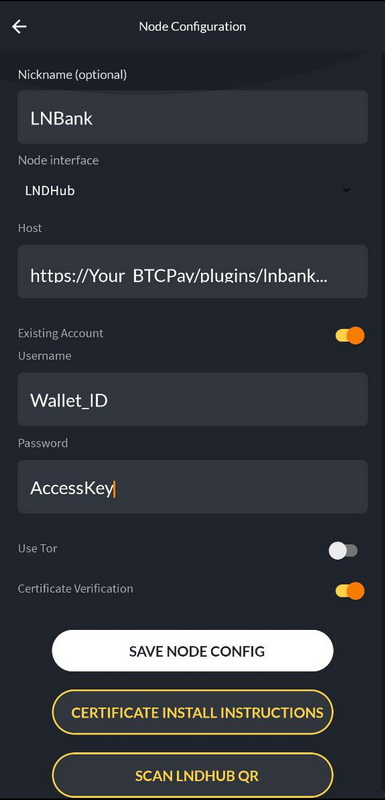

import Tabs from '@theme/Tabs';
import TabItem from '@theme/TabItem';

# Connecting BTCPay Server with ZEUS

BTCPay Server is a payment processor system and could connect to ZEUS in two modes: as node management (CLN or LND) or as LNDhub with the plugin LNBank activated on BTCPay.

### Using CLN/LND interface

1. In your your BTCPay instance, go to services and select ZEUS. It will show you a QR code to scan.
2. Open the ZEUS app and go to **Settings -> Connect a node -> +**.
3. Click on **Node interface** and select **LND** or **C-lightning REST**.
4. Scroll down and press **SCAN BTCPAY config QR**. Scan the lnd/cln QR code from your BTCPay Server config.
5. Disable **Certificate Verification**.
6. Enable **Use Tor** if your BTCPay is running behind Tor.
7. Click on **SAVE NODE CONFIG**.
8. You can now use your BTCPay account as a LN wallet with ZEUS.

### Using LNBank plugin

Keep in mind that lndhub interfaces will not provide any on-chain bitcoin address, only Lightning use.
Unfortunately there is [an issue with ZEUS, which prevents import via QR scan](https://github.com/ZeusLN/zeus/issues/1081). Until this is fixed you have to import the wallet by entrering the details manually.

In ZEUS you can use this path to import the wallet:
1. Open the settings by clicking on the node icon in the top left corner.
2. In the settings click the node (first row) to get to the list of nodes.
3. Click the plus icon in the top right corner to add a new node/wallet.

You will land on the following screen and have to …



- Choose "LNDHub" as the "Node Interface"
- Enable the "Existing account" toggle

On that screen you then have to fill in the host, username and password fields. The values for these fields are included in the account URL which you can copy on the LNbank wallet settings page.

Copy the account URL and paste it into a note app on your mobile device. It consists of the following parts:

```lndhub:// USERNAME : PASSWORD @ HOST```

You can ignore the ```lndhub:// part```, the username and password are separated by an ```:``` and the host is what comes after the ```@```. Copy those values into the corresponding fields in ZEUS and then click "Save node config".

The parts map like this:

- Username = LNbank Wallet ID
- Password = LNbank Wallet Access Key (Admin)
- Host = ```YOUR_BTCPAY/plugins/lnbank/api/lndhub```