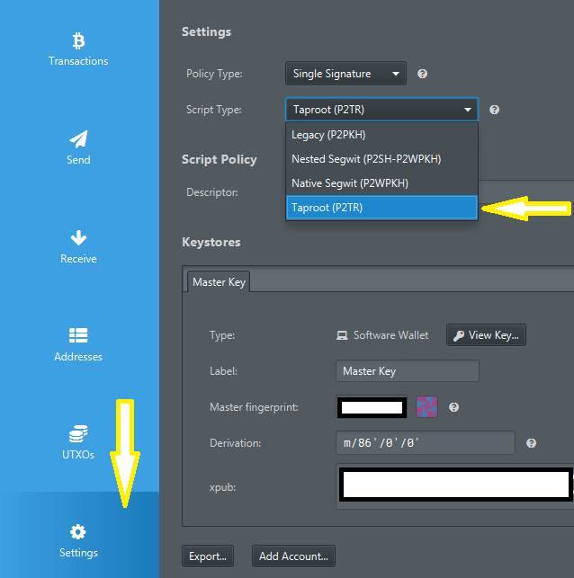

---

---

# Backup and recovery

Back up and recover both lightning and on-chain funds in ZEUS.

There are a few catches, so please read this entire document before trying to restore a wallet or transfer a wallet to a new device.

## BEWARE OF SCAMMERS

### **ZEUS TEAM MEMBERS WILL NEVER ASK YOU FOR YOUR 24 WORD SEED PHRASE**. 

The internet is rife with scammers posing as official support. Do not provide it to anyone. Giving your 24 word seed phrase to others can result in theft of funds.

## Seed phrase format

The embedded node in ZEUS is based on LND and uses the <a href="https://github.com/lightningnetwork/lnd/blob/master/aezeed/README.md">aezeed</a> seed format. This is different than the typical <a href="https://github.com/bitcoin/bips/blob/master/bip-0039.mediawiki">BIP39</a> format you see in most Bitcoin wallets, although it may appear to be similar. aezeed includes some extra data including the birth date of the wallet that will help rescans during recovery happen more efficiently.

## Backing up your seed phrase

ZEUS will prompt you to back up your funds on the Balance view once you have received your first payment, but you can back up your 24 word seed phrase at any point by going to Settings -> Back up wallet.

Tap each pane, one at a time to reveal each word in the seed phrase. You must back up each word, in order, to be able to recover your funds. Make sure you copy all 24; you may need to scroll down on the Back up wallet view to see them all if you have a phone with a lower resolution.

## Backing up your lightning state (disaster recovery data)

The seed phrase alone will be insuffienct to recover all your balances if you have open or pending closing channels.

ZEUS will automatically back up your disaster recovery data to our OLYMPUS servers by default. They are encrypted using your 24 word seed phrase, so we are unable to read them.

You can also manually back up the disaster recovery data by going to Settings -> Embedded Node -> Export recovery data to clipboard. If you choose to back your data up manual, we recommend doing after every new channel open.

## Multiple devices

You <b>CANNOT</b> currently use the embedded node wallet on multiple devices. 

## Preparing to restore a wallet

Restoring a wallet in ZEUS will trigger a force close of all your existing channels, providing that you're using our channel backup service (on by default) or if you input a static channel backup string during the restore process.

Force closes are more expensive than mutual closes. Force closes will also take longer for you to reclaim your funds: up to two weeks. If possible, it is recommended to first close out all your existing channels on your old device before restoring your seed phrase on a new device.

## Restoring a wallet

Once you're ready to recover, go to the Settings menu in ZEUS. It is accessible from the top left corner on the main view (typically an icon of Zeus) if you have a wallet configured already, or by pressing 'Advanced set-up' on the splash screen of a new install.

From there you can add a new node by pressing the top field (it will either say 'No Wallets', or the name of your active connection), and then hitting the plus (+) icon in the top right corner.

From there, enter your 24 word seed phrase in the field labeled 'Recovery Cipher Seed (aezeed)'. You can optionally provide a static backup string in the field labeled 'Disaster recovery data (SCB, Base64)'.

Then press 'Restore mainnet wallet' if you're dealing with real funds or 'Restore testnet wallet' if you're using Bitcoin's test network.

Please leave ZEUS running the first time you restore the seed. It has to go through the recovery process to restore your balance. It is not uncommon for this to take over 10 minutes, especially if you have a heavily used wallet. You may want to temporarily turn off any screen timeouts and energy saving options in your phone's settings, so that ZEUS doesn't go into the background and pause LND during the process.

## Having issues recovering a wallet?

You must leave ZEUS running the first time you restore the seed. It has to go through the recovery process to restore your balance. It is not uncommon for this to take 10 minutes, especially if you have a heavily used wallet. It is advised to reinstall ZEUS and reinitialize the wallet with your seed if you closed it or restarted it before seeing your full balance.

Alternatively, if you want a more manual approach, you may be able to spam the create on-chain address function to get all your addresses indexed in LND's DB and restore your balances. You will likely have to generate both Taproot and SegWit addresses for this approach to work. Since new addreses are generated every time you create an invoice, you may have to generate several hundred addresses of each type.

Then, after your addresess have been generated and indexed, use the 'Rescan' functionality under the Embedded Node settings.

## Have bigger issues?

It is worth reading Lightning Labs' documentation on <a href="https://docs.lightning.engineering/lightning-network-tools/lnd/disaster-recovery">recovering funds from LND</a> in case of a catastrophic failure.

In complicated scenarios, <a href="https://github.com/lightninglabs/chantools">chantools</a> can prove to be a valuable tool.

Remember, funds are recoverable in **most** cases. It's best to proceed calmly, and not try things blindly as some actions can make the situation worse.

## Can I recover my ZEUS onchain wallet into other wallet applications?

The aezeed key format **should** be compatible with the following wallets: Blixt, Blue Wallet and Breez. Note that the seed alone will be insufficient to recover all your balances if you have open or pending closing channels. But only for restoring the onchain wallet funds is enough.

Another option is to use [Sparrow Wallet](https://sparrowwallet.com/) (desktop), but are necessary some preparation steps. This method is also useful in case you want to extract the XPUB for your ZEUS LND node and you want to use it as watch only (deposit-only) in another app. Sparrow will display it in the wallet details.

### Step 1. Get the HD Keys from your ZEUS wallet

To import the ZEUS on-chain ypriv / zpriv keys into Sparrow Wallet you have 2 options:

PLEASE DO NOT SHARE THESE KEYS, THESE ARE FULL ACCESS TO YOUR NODE WALLET, KEEP THEM SAFE.

**OPTION A** - directly from the ZEUS UI, go to Backup wallet - and click on the QR on top right corner. It will take few moments to extract the ypriv/zpriv and will display it in full text format and QR code. Now you can import it into Sparrow and have full access to your onchain wallet. In Sparrow keep in mind to switch between segwit P2WPKH "bc1q" (<a href="https://github.com/bitcoin/bips/blob/master/bip-0084.mediawiki">BIP84</a>) and taproot addresses P2TR "bc1p" (<a href="https://github.com/bitcoin/bips/blob/master/bip-0086.mediawiki">BIP86</a>), depending which format you used previously in ZEUS.

**OPTION B** - Using Cryptography Toolkit by Guggero (LND dev):

- Go to <a href="https://guggero.github.io/cryptography-toolkit/#!/aezeed">Cryptography Toolkit</a> and download the HTML file onto your computer.
- Open that HTML file in "offline mode" (no internet) and select "aezeed Cipher Seed Scheme" from Tools. Then go to the 2nd tab "Decode Mnemonic".
- Paste your 24 words into the "Mnemonic" field.

- Select format BIP84 native segwit and wait a bit to be decoded.
- Copy the zprv displayed into the field "HD node root base 58"

### Step 2. Restore the HD Keys in the Sparrow desktop wallet

- Open (already downloaded) Sparrow wallet app and select "New Wallet"
- In the "Keystores" select "New or Imported Software Wallet"
- In the next window that will open, select "Master Private Key BIP32" and paste that "zprv" key you get it from the cryptography tool and click "Import". It will show you that is a m/84'/0'/0 derivation path. That will import only the segwit P2WPKH type of addresses. But if you used Taproot P2TR addresses, then you should change it into "m/86'/0'/0".
- Click on "Import Keystore" and it will go back to main window of the wallet app where you can see all the wallet config. Click on "Apply" and will prompt you to set a password to encrypt your local wallet file.
- If you used both types of addresses in ZEUS, we suggest to import them as two wallets in Sparrow, using the same "xprv" key but each one with a different derivation path. In this way you can avoid confusions.
- You can also change between segwit and taproot an already imported wallet, by going to wallet Settings and switch the "Scrypt Type" (segwit P2WPKH or taproot P2TR) and then re-import the BIP32 xprv keys to make the switch.

- Sparrow app will start scanning all your keys and txs and it will be displayed after a while in the "Transactions" tab. Patience, it will take some time.
- For a faster, secure and private connection is better to connect your Sparrow wallet app to your node (via Electrum server or directly to a Bitcoin Core RPC)

And done, now you can manage your ZEUS LND onchain wallet from Sparrow.

## chantools: sweepremoteclosed

chantools is a <a href="https://github.com/lightninglabs/chantools">CLI tool</a> for recovering funds from Lightning channel when a user has unfortunately lost their channel state data.

In ZEUS v0.10, we've built in the sometimes needed sweepremoteclosed command, which we've found to be invaluable when users have sync issues or have lost their channel backups.

### Steps

- 1) Go to `Menu` > `Embedded Node` > `Advanced` > `chantools` > `sweepremoteclosed`

- 2) In the field called `Sweep address`, input an on-chain address to receive your funds to, then hit `Start Sweep`. It should take about 5-10 minutes to run.

- 3) If successful you'll reach a page labeled TXHex with a QR code. Simply scroll to the bottom and hit `Broadcast TX to complete the recovery

If you hit error "found 0 sweep targets with total value of 0 satoshis which is below the dust limit of 600", simply try again with `Advanced settings`: `Recovery window` increased. Try 1000, 2500, 5000 if necessary.

If you hit any issues about unexpected characters, you are hitting a rate limit from one of the block explorer settings. Under Advanced settings, set 'Seconds to wait between queries' to 1 and try again. Please be patient as the process will now take a bit longer.