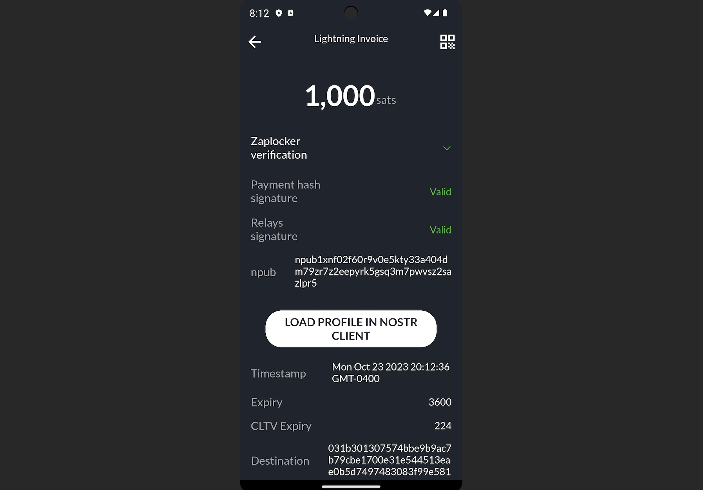

---

---

# FAQ

Frequently asked questions

## I'm having problems making a payment / I can't find a route

By default, ZEUS finds out information about the lightning network graph using P2P. This can take some time. To speed up the graph sync and improve your payment success probability, go to `Menu` -> `Embedded node` -> `Express Graph Sync`. Enable it and restart ZEUS to take effect. You can go to `Menu` > `Network Info` at any point to see how much of the lightning network your node knows about.

If you still can't complete a payment after running Express Graph Sync, you may need to bump up your max payment fee. You can see this tucked away under 'Advanced settings' on the payment request view or under `Menu` -> `Settings` -> `Payments`.

## I'm having issues restoring my wallet

Read our documentation on [Backup and Recovery](https://docs.zeusln.app/for-users/embedded-node/backup-and-recovery#restoring-a-wallet). Please be patient and leave ZEUS running for at least 10 minutes after going through the restore process.

## Can I move on-chain funds to lightning or vice versa?

You can move on-chain funds to lightning by opening up a channel and move lightning funds on-chain by closing a channel.

ZEUS currently doesn't have a swap service, but we're considering launching one in the future.

## How are backups handled?

On-chain funds: You are presented with a 24 word seed phrase that you can back up at any time.

LN funds: By default we send encrypted (with your seed phrase) backups to our server, you can also do manual backups to our server or to your clipboard under `Menu` -> `Embedded node` -> `Disaster recovery`.

Learn more on our [Backups and Recovery](https://docs.zeusln.app/for-users/embedded-node/backup-and-recovery) page.

## Where can I read more about Neutrino and the privacy that block filters provide when syncing ZEUS to the blockchain?

Here's a less technical explanation from [Bitcoin Magazine](https://bitcoinmagazine.com/technical/why-bitcoin-wallets-need-block-filters).

Here are more technical resources from [Bitcoin Optech](https://bitcoinops.org/en/topics/compact-block-filters/).

## Does ZEUS Pay work if you use another LSP or if you have your own channels set up?

Yes, but for best results, a 0-conf channel from OLYMPUS will work best because then you'll have a direct routing path from the service to your node.

There's a fixed routing budget and it can be tricky trying to redeem small amounts if OLYMPUS cannot find a cheap enough route to you.

## How do I open up a channel to the embedded node? The hostname isn't shown.

Please read our document on how to [Open a channel to the embedded LND node](https://docs.zeusln.app/for-users/embedded-node/open-channel-to-embedded-node).

## Simple Taproot Channels sound great. Is there any reason to not use them?

Simple Taproot Channels offer up better on-chain privacy and lower fees on channel closing. There are only two reasons you wouldn't want to use them:

1. They are new, and there still may be bugs in LND when using them.
2. Your counterparty doesn't support them. Even LND nodes have to explicitly opt into them, for now.

## Why do I have to enter in my Nostr nsec key when setting up a ZEUS Pay account?

You don't **have** to use your own Nostr key, but it does allow you, and people paying you, to reap the benefits of [Zaplocker attestation scheme](https://github.com/supertestnet/zaplocker#four-problems-zaplocker-solves).

The key will be used to sign:

- All of the hashes sent to the ZEUS Pay service
- The list of relays you provide to the service

When the sender attempts to pay you from a Zaplocker compatible wallet, like ZEUS, they will be able to the see if the payment request they are being served up is attached to the associated Nostr profile.

Once paid, the sender will then use the relay list to broadcast the attestation. You'll be able to check it in ZEUS by clicking the Nostrich icon next to your payments.

Lastly, you can also opt to receive your ZEUS Pay notifications via Nostr DM, instead of push notifications. They will be sent to the Nostr account of the nsec you profile.

The nsec will never leave your ZEUS wallet.

## I've previously installed ZEUS, and now I can't install the Android package from your website / GitHub. What's going on?

Many Android systems do not allow you to install app upgrades from sources that aren't where you initially downloaded and installed it from. Unfortunately, you'll have to uninstall and reinstall the new version. Be aware, this will clear out your settings so make sure you have backups of your seeds and/or connection strings.

## Help! My wallet balance has disappeared!

### What's happened?

#### If it's on-chain funds that have gone missing

ZEUS uses Neutrino block filters to fetch on-chain information in private manner. Sometimes your wallet can get out of sync with the default Neutrino peers.

#### If it's lightning funds that have gone missing

It is possible that your lightning channel has been closed. You will receive the funds on-chain once the channel has been closed.

### What should I do?

#### If it's on-chain funds that have gone missing

First, you should try doing a rescan by going to `Menu` -> `Embedded node` -> `Advanced` -> `Rescan wallet` and restarting the app. Please leave the app running in the foreground for up to 15 minutes to complete the process. During the rescan process you will not be able to full use the app - for example, you will not be able to generate invoices. You can follow the rescan process by following the LND logs at `Menu` -> `Embedded node` -> `LND Logs`.

If rescan fails to correct the balance, you'll likely have to add some more Neutrino peers, especially if the LND logs display messages about peer connection timeouts.

To add more Neutrino peers got to `Menu` -> `Embedded node` -> `Peers` -> `Neutrino Peers`. Then uncheck `Connect only to the specified peers`, restart the app, and try another rescan. This will allow your ZEUS wallet node to find new peers to connect to automatically.

If you have your own remote node, you may also want manually add it in the Peers list. You can [use this guide to enabled 'Neutrino mode' in Bitcoin Core](https://docs.lightning.engineering/lightning-network-tools/lnd/enable-neutrino-mode-in-bitcoin-core). BTCD has Neutrino on by default.

#### If it's lightning funds that have gone missing

Go to the Channels view by hitting the icon in the bottom right corner of the main view then, hit the header at the top of the Channels view to toggle between open, pending, and closed channels. Mutually closed channels should return to your on-chain balance once they settle on-chain. Force closed channels can take up to two weeks to return to your on-chain wallet. These channels will appear in the pending channels list until settled.

## I'm having problems sending lightning payments with ZEUS

First, go to `Menu` > `Network Info` and make sure there are no zombie channels. Zombie channels are channels that are most likely dead but are still around, but with the embedded node sometimes we get false positives.

If you have zombie channels (>2000), go to `Menu` -> `Embedded node` -> `Express Graph Sync` and enable the second toggle labeled `Reset express graph sync on startup`, then restart. Be sure to go back to `Menu` > `Network Info` and ensure your zombie channel count is significantly reduced.

If you don't have zombie channels and are still having issues sending lightning payments, go to `Menu` -> `Embedded node` -> `Advanced` -> `Pathfinding` and press the button labeled `Reset payment routing profile`.

## My channels are showing as offline. How can I get them to show as active again?

This typically happens when either the blockchain headers or lightning network graph is out of sync, or the RPC server is having issues starting up. To resolve this, try the following steps one at a time. After each step, check if the issue is resolved before moving on to the next. Please note: None of these steps lead to loss of any data, such as payment history, notes, wallet configurations, or other settings.

 1. Pull down on the channels list to refresh it. If channels still show as offline, leave the app running for about 10 minutes. Sometimes the RPC server just needs time to start up.

 2. Go to `Menu` -> `Embedded node` -> `Advanced` and press the button labeled `Stop LND and delete Neutrino files`, then restart the app. This will resync your blockchain data.

 3. Go to `Menu` -> `Embedded node` -> `Express Graph Sync` and enable the second toggle labeled `Reset express graph sync on startup`, then restart the app. This will resync your lightning network graph data.

 4. If your channels are still not showing as online after performing steps 1-3, your wallet may be rescanning. You can follow progress under `Menu` -> `Embedded node` -> `LND Logs`. Look for logs with text 'Rescanning through' and 'Rescanned through'.

## I'm having issues syncing. Sync is either stuck or won't start. What can I do?

For sync issues we recommended going through your Neutrino peer list and removing all the peers with high ping times. <200ms is optimal. <1000ms should still work. To access the Neutrino peers list, go to `Menu` > `Embedded node` > `Peers` > `Neutrino`.

If issues persist, reset the Neutrino data by pressing `Stop LND and delete Neutrino files` under `Menu` > `Embedded Node` > `Advanced` and restart the sync from scratch.

## I restored my 24 words in ZEUS and my funds are still not showing up. Where are they?

During a restore, all on-chain funds should appear after the restore process has completed. However, funds on lightning have to go through the force close process, which typically takes 3 days after the close transaction confirms on-chain.

You should be able to see your pending close channels by going to the `Channels` view (the second icon from the right in the wallet navigation bar on the bottom of the main view), and tapping on the header to cycle between Open, Pending and Closed channels. If your previously open channels don't appear, go to `Menu` -> `Embedded node` -> `Disaster recovery` and trigger a recovery by pressing `Initiate disaster recovery from Olympus` or by going to `Initiate advanced disaster recovery from Olympus` and manually selecting a backup to restore from.

For more details, visit our page on [Backup and Recovery](https://docs.zeusln.app/for-users/embedded-node/backup-and-recovery/).

## I'm having issues broadcasting on-chain transactions. They are either disappearing from my wallet or not showing up on a block explorer.

This is indicative of a sync issue.

Firstly, if you see the outgoing on-chain transaction under the `Activity` view you can press the `Raw transaction Hex` label and manually broadcast the TX by hitting `Broadcast to Mempool.space`. This will send the transaction directly to a popular block explorer. If it returns error `{"code":-25,"message":"bad-txns-inputs-missingorspent"}` - this means that you have sync issues.

To remedy this, go through your Neutrino peer list and removing all the peers with high ping times. <200ms is optimal. <1000ms should still work. To access the Neutrino peers list, go to `Menu` > `Embedded node` > `Peers` > `Neutrino`. Once you have reconfigured your peers, restart the app. To remove errant, invalid, transactions and fix any issues with your displayed balance, go to `Menu` -> `Embedded node` -> `Rescan` and restart the app. The process should take 5-10 minutes. You can follow along with the process under `Menu` -> `Embedded node` -> `LND Logs`.