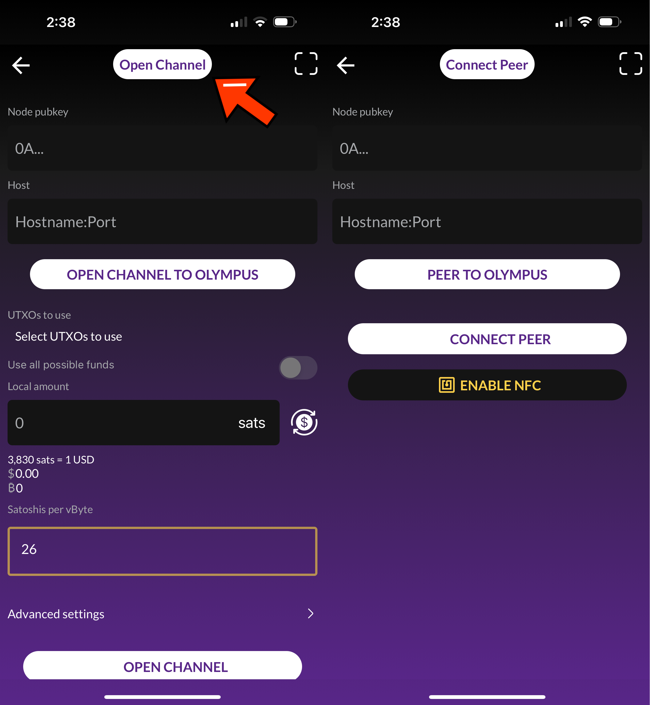

---

---

# Open a channel to the embedded LND node

## Overview

This page will walk you through how to open up a channel from another lightning node to the embedded LND node in Zeus v0.8+.

The embedded node lives on your phone and is usually offline so it doesn't make sense to expose a URI or node address on the lightning network for others to connect to. Instead, you must initiate the peer connection yourself from the embedded node.

## Steps

### 1. From the embedded node, connect to your remote node as a peer

Go to the Open Channel view in Zeus. You can get there by going to the channels pane in the bottom right corner of the main view. Once you're on the Channels pane, press the plus icon (+) in the top right corner to get to the Open Channel view.

From the Open Channel view, you can press on the header to switch to Connect Peer mode. The header and the fields will change to reflect the mode.

From the Connect Peer mode, enter in the remote node's pubkey and host, and then press the Connect Peer button. If successful, Zeus should return a message saying that you've successfully connected to your peer.

### 2. Add your remote node as a zero conf peer

Navigate to `Settings` > `Embedded Node` > `Peers` > `Zero conf Peers`, and add your remote node's public key to the Zero conf peers list.

### 3. From the remote node, open up a channel

Now that you've established a peer connection from the embedded node to the remote node, you can now open up a channel from the remote node to the embedded node.

You may also want to consider <a href="/for-users/embedded-node/trusted-funding">opening a trusted channel</a> instead so that you don't pay any on-chain fees and reap other benefits.