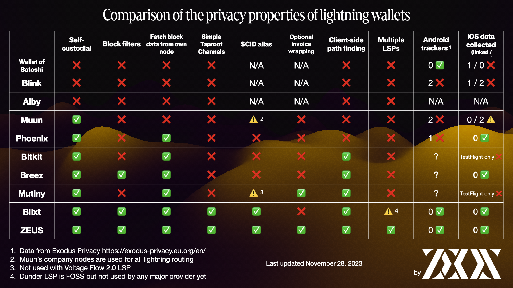

---

---

# Privacy

Learn about the privacy properties of the Embedded Node + LSP

## Invoice wrapping

Onboarding to lightning can be difficult and overwhelming to new users. So we've lowered the barrier to entry with a channel service from our new lightning service provider (LSP), OLYMPUS by ZEUS.

Users can generate invoices without having previously set up lightning payment channels, and have them paid and settled, nearly instantly, with our 0-conf channel service.

The LSP also provides added privacy to our users by providing them with wrapped invoices that conceal their nodes' public keys from payers.

The LSP is on by default, but users can choose to opt out of it. It is currently only available to use with embedded nodes, but we hope to extend functionality to remote nodes soon.

[Read more about our LSP here.](https://docs.zeusln.app/lsp/intro/?ref=blog.zeusln.com)

## Simple Taproot Channels

ZEUS v0.8.0 is the first mobile wallet to include support for Simple Taproot Channels. When closing these channels, users incur less fees and are given more privacy as they appear to be identical to any other Taproot spend when examining their on-chain footprint.

Simple Taproot Channels can also be requested from our LSP, OLYMPUS by ZEUS.

## Neutrino block filters

When checking your addresses' balances, many Bitcoin wallets leak those addresses and balances to wallet providers, or another third party. ZEUS doesn't.

Block sync with ZEUS' embedded node is done using block filters and the Neutrino protocol so we are given no information about our users' on-chain funds.

You can get a great technical resources on block filters over at [Bitcoin Optech](https://bitcoinops.org/en/topics/compact-block-filters/), and a more digestable overview over at [Bitcoin Magazine](https://bitcoinmagazine.com/technical/why-bitcoin-wallets-need-block-filters).

## Client-side path finding

Client-side path finding: ZEUS constructs users' lightning payment paths on their devices, so we don't know the final destinations of our users' payments, even when they're forwarded through our channels.

Not only do we not want to know how you're using your money, but we're building things in a way that we can't.

Not all wallets can say the same.

## How does ZEUS stack up against other lightning wallets?

