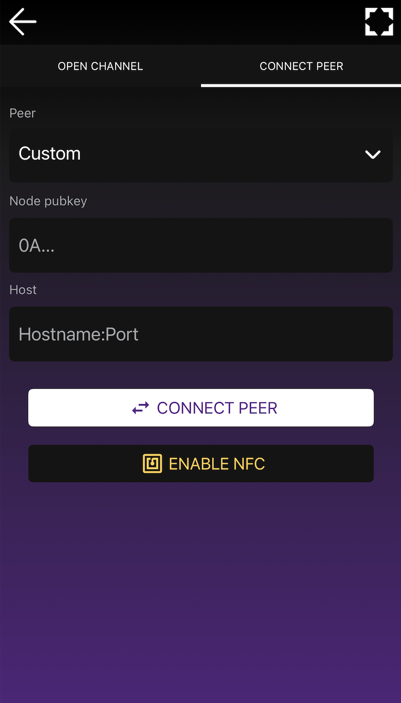
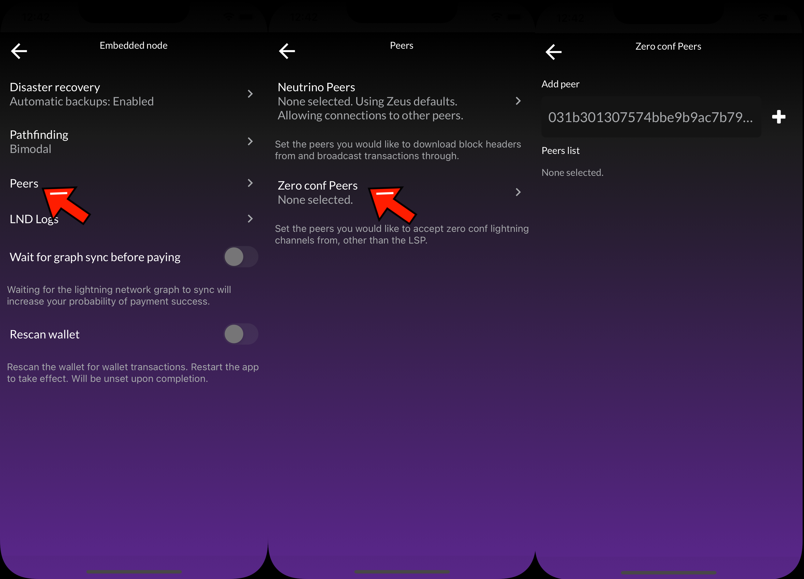

---
---

# Open a trusted funding channel to the embedded node

## Overview

One potential setup you can have with your in-app, embedded node in ZEUS v0.8: connect to your routing node at home (or in the cloud) with a private 0-conf channel.

There are a lot of perks to this set up. You skip on-chain fees, save on routing fees, segregate your main LN funds from your phone, and potentially skip the need to backup your mobile wallet.

**WARNING: this is an ADVANCED procedure. You should be comfortable with compiling LND from source, modifying your LND configuration, and running software with NodeJS. Please read the full document before proceeding.**

## Steps

Before you begin, be sure you have your Zeus running on "Persistent Mode". That will keep alive the LND service, unintrerrupted in case you switch screens or the phone goes on power saving mode. To activate "Persistent Mode", go to **Settings** - **Embedded Node** - **Advanced** - **Persistent Mode**, switch on the button. It will ask you to restart Zeus. After restart proceed with the next steps.

### 1 On the remote node, enable zero-conf channels

In your `lnd.conf` add the following lines:

```
[protocol]
protocol.option-scid-alias=true
protocol.zero-conf=true
```

### 2. From the embedded node, connect to your remote node as a peer

Go to the Open Channel view in ZEUS. You can get there by going to the channels pane in the bottom right corner of the main view. Once you're on the Channels pane, press the plus icon (+) in the top right corner to get to the Open Channel view.

In the Open Channel view, you will now see two tabs in the header: **Open Channel** and **Connect Peer**. You can switch between these tabs to change the view accordingly.

From the Connect Peer tab, you will see a Peer input field with a dropdown. By default, it is set to OLYMPUS BY ZEUS, you need to tap on it and select Custom to manually enter the values. Once set to Custom, enter the remote node's pubkey and host, then press the Connect Peer button. If successful, ZEUS will return a message confirming that you've successfully connected to your peer.



### 3. Add your remote node as a zero conf peer

Navigate to `Settings` > `Embedded Node` > `Peers` > `Zero conf Peers`, and add your remote node's public key to the Zero conf peers list.



### 4. From the remote node, open up a trusted funding channel using Balance of Satoshis (BOS)

Now that you've established a peer connection from the embedded node to the remote node, you can now open up a channel from the remote node to the embedded node.

To open up the trusted funding channel, you must be using an LND node with the <a href="https://github.com/alexbosworth/balanceofsatoshis/">BOS command line tool</a>

On the remote node run:

`bos open <embedded-node-public-key> --type private-trusted --avoid-broadcast --amount <amount-in-sats>`

The `--avoid-broadcast` flag will ensure that sure you never broadcast the transaction. This channel will never be reflected on-chain.

### 5. Be prepared to close channels out with abandonchannel

In our experience, we've had some of these trusted channels get out of wack and go into 'borked' states on LND. To close them out we've had to use the `lncli abandonchannel` command which requires building LND with the devrpc flag enabled.

**Note that this is a dangerous command**. You should not use it without understanding the consequences of it. You should ensure that the channel opening and closing were never broadcasted before using it.
