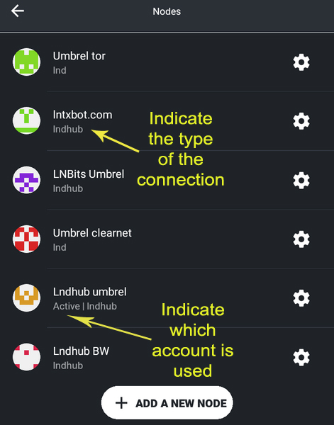
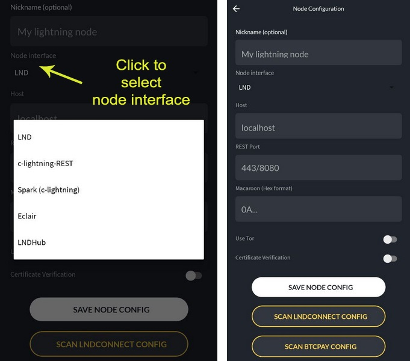

# Accounts

In this section, you can setup all your connections to various types of nodes and accounts to lndhub. As you can see in this example, you can manage a various number of nodes, without interfering each others and you can select which one can be active to use anytime.

Also to mention that each account works independently, no matter if is using Tor, clearnet, Tailscale, local IP etc. Once you switch between them, ZEUS will make the connection without restart needed. Just have patience if you switch from a clearnet connection to a Tor one, so that will take a while until Tor network is bootstraping your relays.

## Operations
1. Create a new connection, by clicking on **+ Add new node**. You will redirected to a new screen where you can fill the details or simply scan the node QR URI code and will be filled out automatically. Put a nick name your connection to be easily identified later. Then select the node interface (LND, CLN, lndhub etc). Don't forget to select **Use Tor** if your node is running on Tor network. See more connection examples in the chapter [Connecting to ZEUS](https://docs.zeusln.app/for-users/getting-started/lightning-node-connect).

2. Select an existing account, just by pressing it quickly. It will redirect you to the main screen, waiting for connection.
3. Edit an existing account, by clicking on the right arrow **>** and will redirect you to the configuration menu for that account. In this screen you can also delete the account.
4. Future option will be to save the profiles configuration into a file, to be able to restore them if you migrate to a new device.