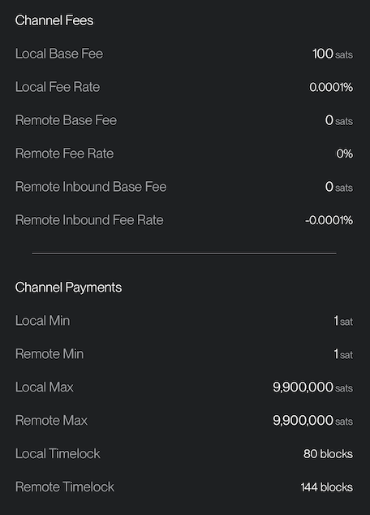

# Channels

In this section, you could manage your Lightning node channels. As you can see in this example, the main screen of the channel management is very intuitive and it displays essential information about your node:

## Main screen channels
1. On the top of the screen, we have a review of total node liquidity, separated by outbound (max you can send) and inbound (max you can receive), plus the offline balance, from channels that are not connected.
2. Under the balance you have the list of all channels you have with their status and individual balance (inbound and outbound)
3. At the bottom you have the button to go to **Home Main Screen**

## Operations
- If you click on a channel, you will open a new menu to manage that specific channel. You can set specific routing fees and initiate the closure of the channel.
- You can also check the fees your node is charging for forwarding payments through your channels (routing).

As you can see in the following examples, Zeus displays a lot of information about the channel status, organized in three parts:

### Channel General Information

- The peer node alias and its nodeID
- Channel balance (local and remote)
- Channel Status (active, if it is online, disabled, if it is offline)
- Channel type: Private (unannounced) or Public (announced on the public graph). Usually mobile LN nodes use private channels by default, but you can also open private channels from your desktop node, using Zeus, depending of your use.
- Total usage of the channel (send / receive)
- Capacity of the channel in sats
- Commit fees, that can vary in time. Read more here: [commit fee Q1](https://old.reddit.com/r/lightningnetwork/comments/cjtbjt/question_regarding_commit_fee/) | [commit fee Q2](https://bitcoin.stackexchange.com/questions/89232/why-is-my-spendable-msat-much-lower-than-msatoshi-to-us/89235#89235) | [Lightning fees](https://lightningwiki.net/index.php/Fees)

### Counterparty Channel Settings

- Peer Fees applied to the channel: Base Fee is fixed per transaction, Fee Rate is ppm (parts per million), applied to the amount of the transaction.
- Min / Max HTLC: minimum can be set in milisats and maximum can be no more than total channel size, minus channel reserve (usually 1%). [Read more about what is HTLC here](https://docs.lightning.engineering/the-lightning-network/multihop-payments/hash-time-lock-contract-htlc).
- TimeLock Delta: depending on which LN implementation is used, there will be a different default value (but it can be changed). Default values: LND 40 blocks, CLN 34 blocks, Eclair 144 blocks. Read more about CLTV Delta here: [What is CLTV TimeLock?](https://docs.lightning.engineering/the-lightning-network/multihop-payments/timelocks) | [What is a decent value for CLTV?](https://bitcoin.stackexchange.com/questions/89658/what-is-a-decent-value-for-time-lock-delta-on-a-lightning-network-node)
- Last Update: displays when was last update of the channel from your peers side (changing fees, status etc).

### Intitating Party (Your node)

- Your Fees applied to the channel
- Min / Max HTLC
- TimeLock Delta
- Last Update, displays when was last time the channel update from your side.
- Set new fees (for your side of the channel)
- Close Channel: This will trigger by default a **cooperative close** (faster and cheaper, but your peer needs to be online) but you can also trigger a **force close** of the channel (slower and more expensive), if the peer is not online or not responsive.
- Keysend: this is a powerful feature, that can be used in many ways. 

You can send / push funds directly to a channel peer or to another node, adding a message if desired. Keysend doesn't require an LN invoice to be generated first, so be aware that once the funds are sent, you do not have any other proof of the transaction, only the secret hash from your own transaction log. For a keysend payment between 2 peers, the payment is totally private.

The keysend could be used also in the process of balancing a channel, with the so called **Ghetto Swap**. You practically push an amount of sats to the other side, using keysend and your peer will have to give you back those sats from one of his onchain wallets or another LN wallet. Be aware, do this only with trusted peers, so don't do this procees with random peers you have open channels with. It requires a previously agreement between parties.

More to read about keysend: [CLN keysend description](https://lightning.readthedocs.io/lightning-keysend.7.html) | [LND keysend description](https://docs.lightning.engineering/lightning-network-tools/lnd/send-messages-with-keysend)