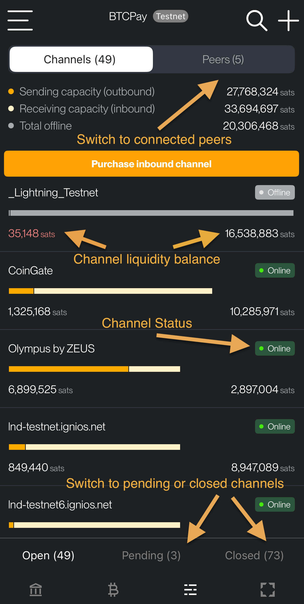
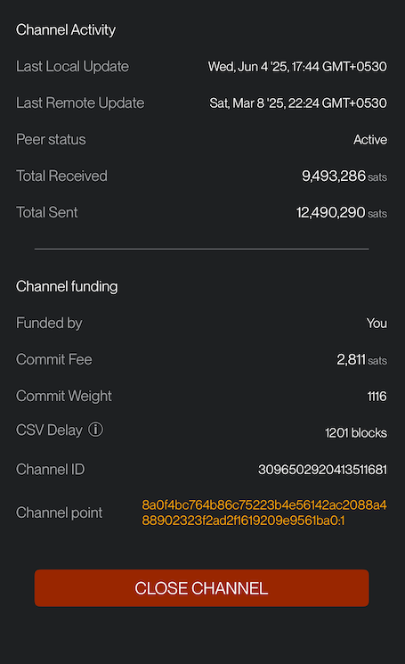

# Channels

In this section, you could manage your Lightning node channels. As you can see in this example, the main screen of the channel management is very intuitive and it displays essential information about your node:

## Main screen channels

The main channel management screen is divided into several sections:

- **Tabs**: At the top of the view, there are two tabs:

  - **Channels**: This is the current view, showing all your channels.
  - **Peers**: Selecting this tab will show a list of peers connected to your node, with an option to disconnect them.

- **Liquidity Summary**: A summary of your node's total liquidity, broken down into:

  - **Outbound:** The maximum amount you can send.
  - **Inbound:** The maximum amount you can receive.
  - **Offline Balance:** The balance from channels that are currently disconnected.

- **Channel List**: Below this, you'll see a list of all your channels, including their current status and individual inbound/outbound balances.

- **Channel State Tabs (LND Only)**: At the bottom of the channels view, you can switch between **Open**, **Closed**, and **Pending** channel states.

## Operations

- If you click on a channel, you will open a new view to manage that specific channel. Here, You can set specific routing fees and initiate the closure of the channel.
- You can also check the fees your node is charging for forwarding payments through your channels (routing).

As you can see in the following examples, ZEUS displays a lot of information about the channel status, organized in several parts:

### Channel General Information

- **Peer**: The alias and node ID of the peer you have a channel with.
- **Channel ID**: The unique identifier for this channel.
- **Short Channel ID**: This is an alias that is used by your node to identify a channel before confirmation of its funding transaction.
- **Announced**: Whether the channel is public (announced) or private.
- **Commitment Type**: The type of commitment transaction used for this channel.

#### Channel Balance

- **Local Balance**: The amount of funds on your side of the channel.
- **Remote Balance**: The amount of funds on your peer's side of the channel.
- **Outbound**: The amount you can currently send through this channel.
- **Inbound**: The amount you can currently receive through this channel.
- **Local Reserve**: The amount of funds you are required to keep on your side of the channel.
- **Remote Reserve**: The amount of funds your peer is required to keep on their side of the channel.
- **Capacity**: The total amount of funds in the channel.

#### Channel Fees

- **Local Base Fee**: The fixed fee you charge for routing payments through this channel.
- **Local Fee Rate**: The proportional fee you charge based on the payment amount.
- **Remote Base Fee**: The fixed fee your peer charges for routing payments through this channel.
- **Remote Fee Rate**: The proportional fee your peer charges based on the payment amount.
- **Remote Inbound Base Fee**: The fixed fee your peer charges for receiving payments.
- **Remote Inbound Fee Rate**: The proportional fee your peer charges for receiving payments.

#### Channel Payments

- **Local Min**: The minimum payment amount you can send.
- **Remote Min**: The minimum payment amount your peer can send.
- **Local Max**: The maximum payment amount you can send.
- **Remote Max**: The maximum payment amount your peer can send.
- **Local Timelock**: The number of blocks you have to claim your funds in case of a force close.
- **Remote Timelock**: The number of blocks your peer has to claim their funds in case of a force close.

#### Channel Activity

- **Last Local Update**: The timestamp of the last update you made to the channel.
- **Last Remote Update**: The timestamp of the last update your peer made to the channel.
- **Peer Status**: The current status of your peer (e.g., Active).
- **Total Received**: The total amount of funds you have received through this channel.
- **Total Sent**: The total amount of funds you have sent through this channel.

#### Channel Funding

- **Funded by**: Who initiated the channel funding (e.g., You).
- **Commit Fee**: The fee for the commitment transaction. Read more here: [commit fee Q1](https://old.reddit.com/r/lightningnetwork/comments/cjtbjt/question_regarding_commit_fee/) | [commit fee Q2](https://bitcoin.stackexchange.com/questions/89232/why-is-my-spendable-msat-much-lower-than-msatoshi-to-us/89235#89235) | [Lightning fees](https://lightningwiki.net/index.php/Fees)
- **Commit Weight**: The weight of the commitment transaction.
- **CSV Delay**: The number of blocks that must pass before a force-closed channel can be swept.
- **Channel ID**: The unique identifier for this channel.
- **Channel Point**: The transaction output that created this channel.

#### Close Channel

When you tap the **Close Channel** button, you can initiate a force close, or you can cooperatively close the channel by setting up a custom fee, or specify an external address for your funds before confirming the closure.
