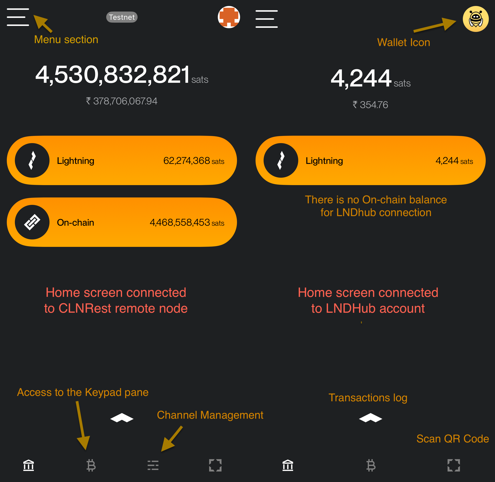
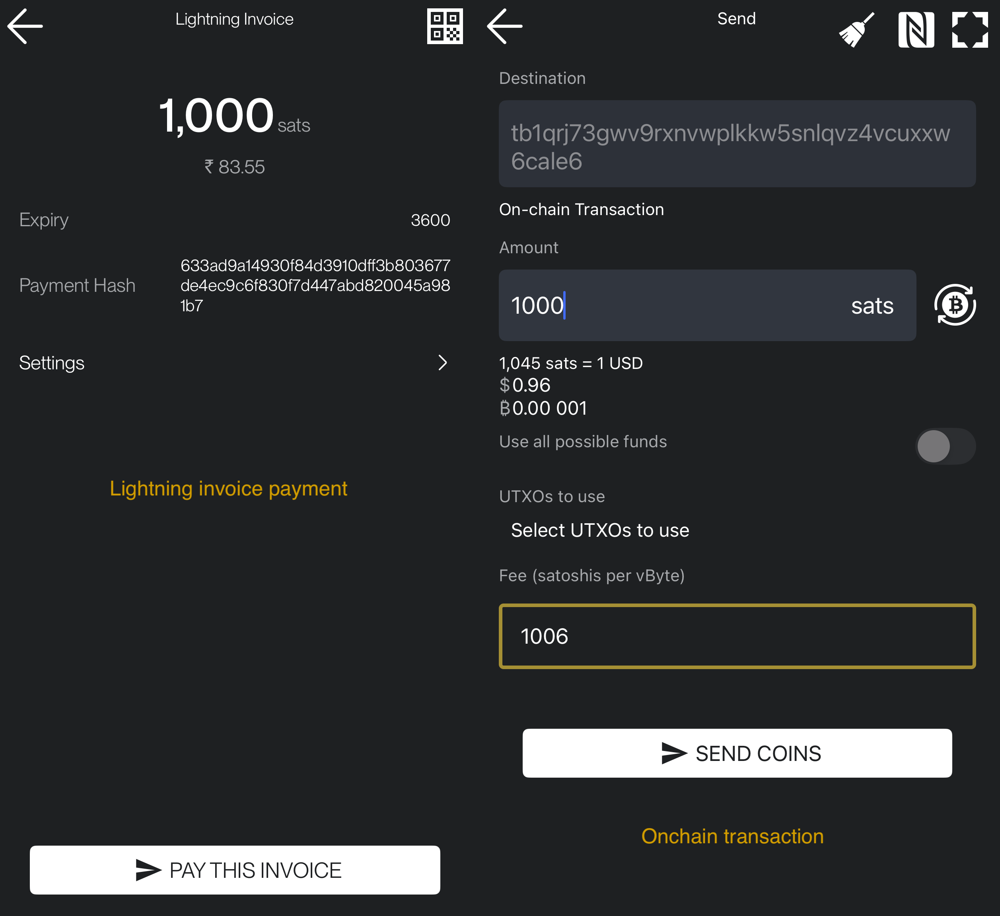
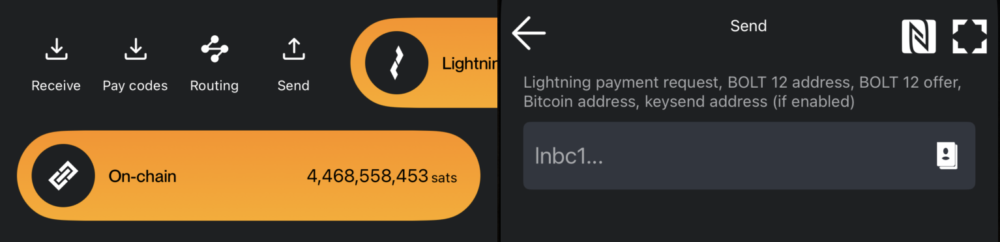
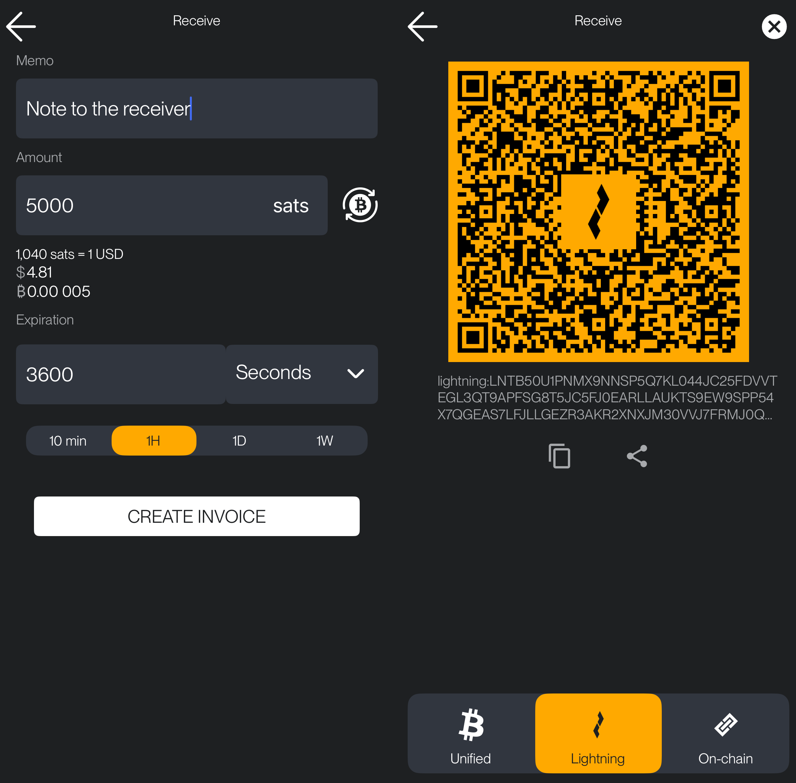
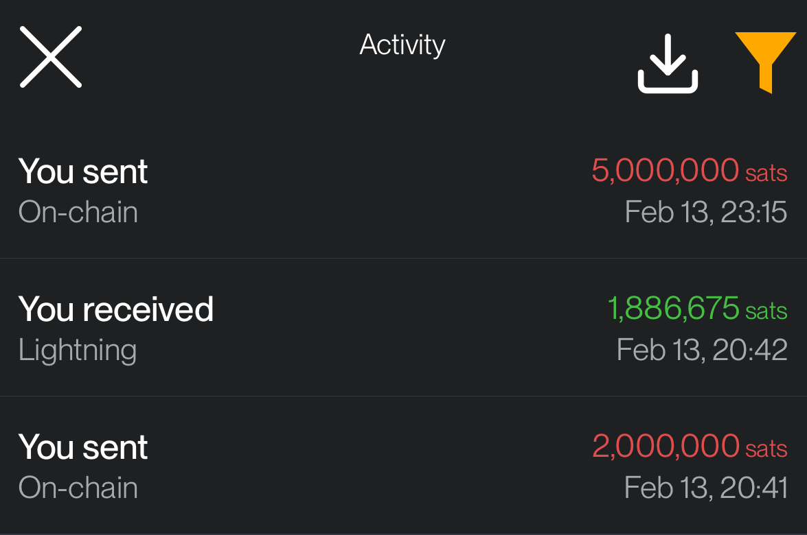

# Home

The ZEUS home screen is very simple and intuitive, so the user can have a quick access to main functionalities and have a great user experience.

## Home screen sections

- On the top left corner, we have access to the **Menu** section, where you can navigate to the **Wallets** section and manage all app settings.
- On the top right corner, we have quick access to the **Wallets** screen, where you can view all wallets available in the app.
- On the bottom right corner, we have quick access to the **Camera** to scan QR codes.
- In the middle, we have access to **Lightning** and **On-chain balances**. If you slide them to the right, you get access to **Send** and **Receive** actions.
- At the bottom, we have access to:
  - **Transactions log** (**^**)
  - **LN Channels Management** (🧮)
  - **Home Button** (🏛)
  - **Scan Icon** (📷)
  - **Bitcoin Icon**: Tapping this icon will take you to the Keypad Pane view, where you can enter the amount to request or pay an invoice.

Here are two examples of home screens, one connected to a **remote CLNRest node** and another to an **LNDHub account**.

## Operations

### Make a payment

You have two options:

**1. Scan a QR Code**

- Click on the camera button in the **bottom right corner**, scan the QR code for the **Lightning invoice** or **Bitcoin address**, and proceed to the next screen, where you can preview the payment details.
- On the preview screen, tap on **PAY INVOICE** for a **Lightning payment** or **SEND COINS** for a **onchain transaction**, accordingly.

**2. Manual Entry**

- Slide right on the payment method you want to use (Lightning or onchain) and click on **Send** icon button. You will be prompted to paste a LN invoice, bitcoin address, Lightning Address, LNURL, node public key for a keysend.

### Receive a payment

- Slide right on any of the methods (Lightning or On-chain) to open the Receive Payment screen.
- On this screen, you need to enter the amount for the invoice and set an expiration time for it. Optionally, you can add a description/memo, which will also be visible to the payer.
- After entering the details, tap on Create Invoice. You will then see a QR code and invoice string that can be shared with the payer.
- At the bottom of the screen, you can select from three tabs to share:
  - Lightning Invoice
  - On-chain Address
  - Unified Invoice

### Transactions log

By sliding up the small arrow **^** at the bottom of the main screen you could access the full log of wallet transactions. Click on any of the listed items and you could see more details about that transaction.

The Transaction log contains a record of:

- **Lightning Payments** – Sent and received Lightning payments.
- **On-chain Transactions** – Bitcoin transactions sent or received on-chain.
- **Invoices** – Created Lightning invoices.

