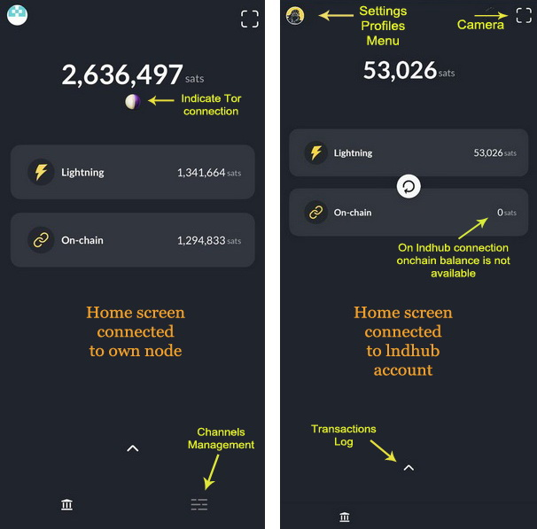
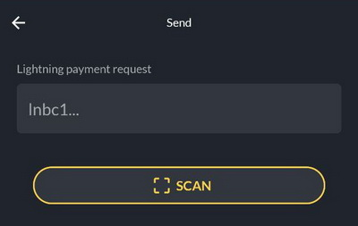

# Home
Zeus home screen is very simple and intuitive, so the user can have a quick access to main functionalities and have a great user experience.

Home screen sections are the following:
- On the left top corner we have the access to settings and profiles.
- On the right top corner is the quick access to camera, to scan QR codes.
- In the middle we have the access to Lightning wallet and On-chain wallet. If you slide them to the right you get access to **Send** and **Recevive** actions, for each wallet.
- At the bottom, we have the access to the transactions log (the arrow ^), access to LN channels management (🧮) and the home (🏛) button.

### Operations
**To make a payment**

You have two options:
- click on the camera button on top right corner, scan the QR code for the LN invoice or bitcoin address and continue to the nest screen with preview details about the payment you are about to make and then click on **Send** button.

- slide right the wallet you want to use (LN or onchain) and click on **Send** button. You will be prompted to paste a LN invoice, bitcoin address, Lightning Address, LNURL, node public key for a keysend.

**To receive a payment**

You slide right any of the wallets (LN or onchain) and you will be prompted with a screen, where you can choose from top tabs **Lightning** or **Onchain**. Optional you could put a description / memo to the payment and will be displayed also to the payer. Put the amount in sats and will display also the amount in fiat currency bellow. Click on **Create invoice** and will display a QR code and invoice string to be shared with your payer.

**Transactions log**

By sliding up the small arrow **^** at the bottom of the main screen you could access the full log of wallet transactions. Click on any of the listed items and you could see more details about that transaction.

