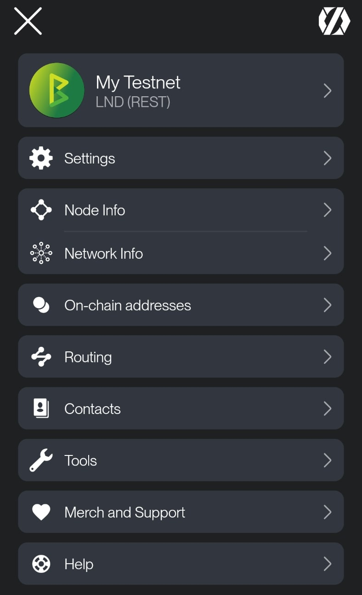
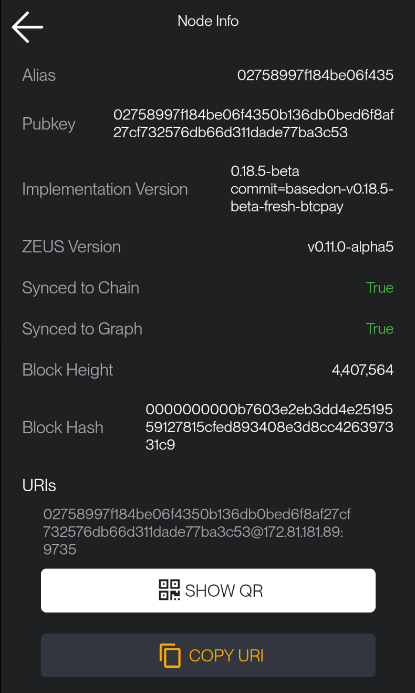
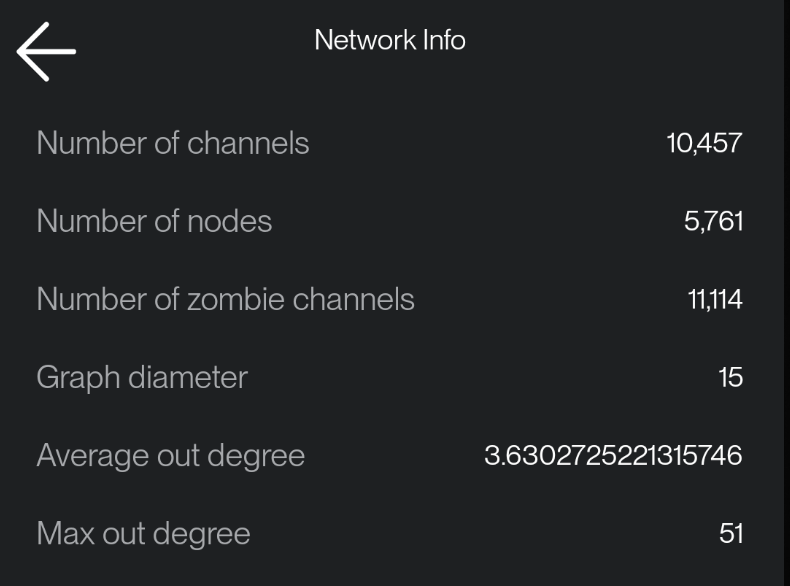
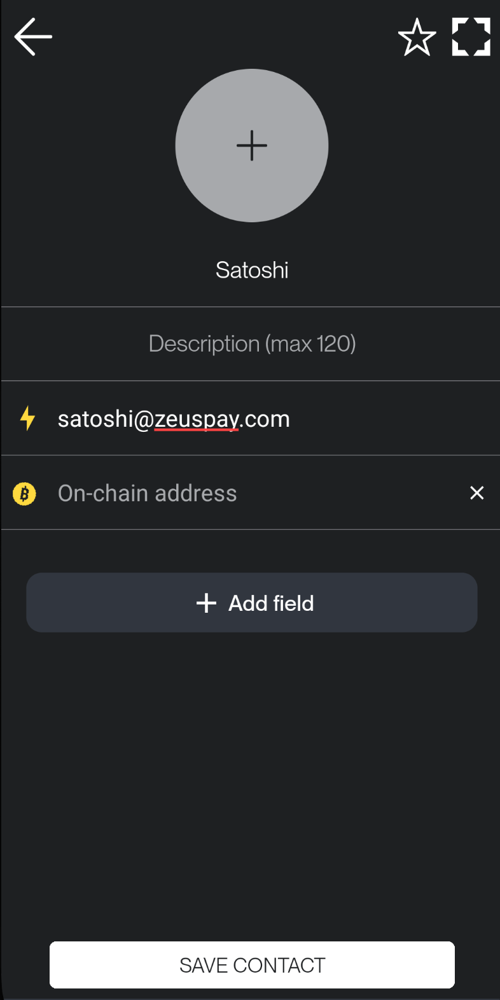
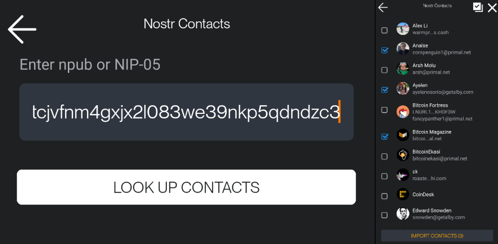

---
---

# Menu

The **Menu** in ZEUS offers centralized access to all essential app features, settings, and utilities.

# Settings

Access the full list of ZEUS preferences. From here, you can configure your wallet behavior, visual appearance, language, currency, and security options.

## Wallets

Manage all wallet connections. You can add new ones or switch between existing wallets. Each wallet is independent and configurable. For more, see the [Wallets section](./wallets.md).

## Node Info

See more details about your LN node, to which you connect ZEUS (Alias, LN version, node URI, QR URI, NFC).

## Network Info

Provides an overview of the Lightning Network, including the total number of channels, number of zombie channels, and number of nodes.

## On-chain Addresses

View and manage all on-chain addresses used by your wallet. You can also generate new receiving addresses for each connected wallet here.

## Routing

Shows your node's current routing policy and fee settings.

## Contacts

Access your contact list. You can create new entries manually or import contacts from Nostr.

## Tools

This section gives you helpful tools to manage your wallet.

- **Accounts**  
  Manage multiple wallet accounts.

- **Speed Up Transaction**  
  Boost the confirmation speed of unconfirmed on-chain transactions by rebroadcasting them with a higher fee.

- **Sign / Verify Message**  
  Cryptographically sign or verify messages using your wallet keys.

- **Currency Converter**  
   Convert between BTC/sats and over 94 fiat currencies.

- **Sweep On-chain Wallet**  
   Sweep on-chain funds to another address.

- **Export Activities**  
  Import all your wallet activity including on-chain transactions, Lightning payments, and invoices into a CSV file.

- **Developer Mode**  
  Access API call results and node responses, useful for developers.

## Merch & Support

Support ZEUS by browsing the merch store or donating. Your support helps keep development going strong.

## Help

Access documentation and open GitHub issues directly from the app to report bugs or request features.
