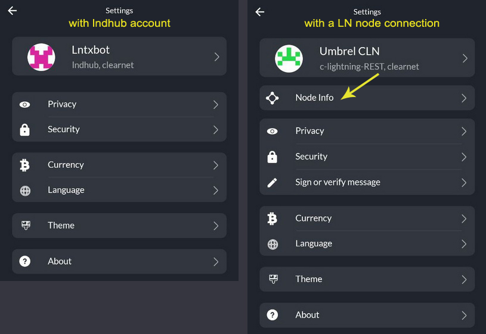

---

---

# Settings

In this section, you could configure and personalize your ZEUS, connect to various nodes and accounts.

## Main options
1. **Wallets menu** - Add or select default connection to various types (see more details in [Wallets section](wallets.md))
2. **Node Info** - See more details about your LN node, to which you connect ZEUS (Alias, LN version, node URI, QR URI, NFC).
3. **Privacy menu** - set **lurker mode** to hide your mains creen balances and mempool options

4. **Security menu** - to set or change a password or PIN to open your ZEUS

5. **Currency menu** - to set a local fiat currency conversion
6. **Language menu** - set your ZEUS language displayed (27+ languages available). If you want to contribute with another language translation, you can join our [Transifex page](https://explore.transifex.com/ZeusLN/zeus/).
7. **Theme** - choose a theme for ZEUS
8. **About** - links to more ZEUS contact and information