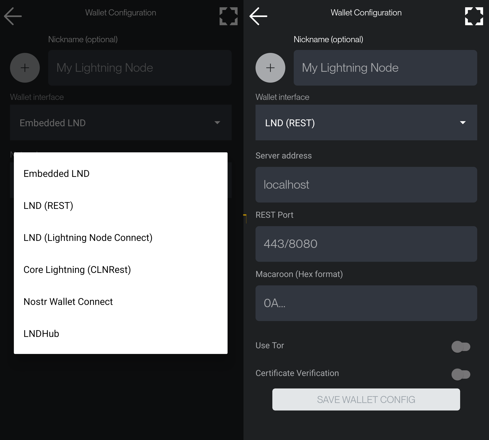
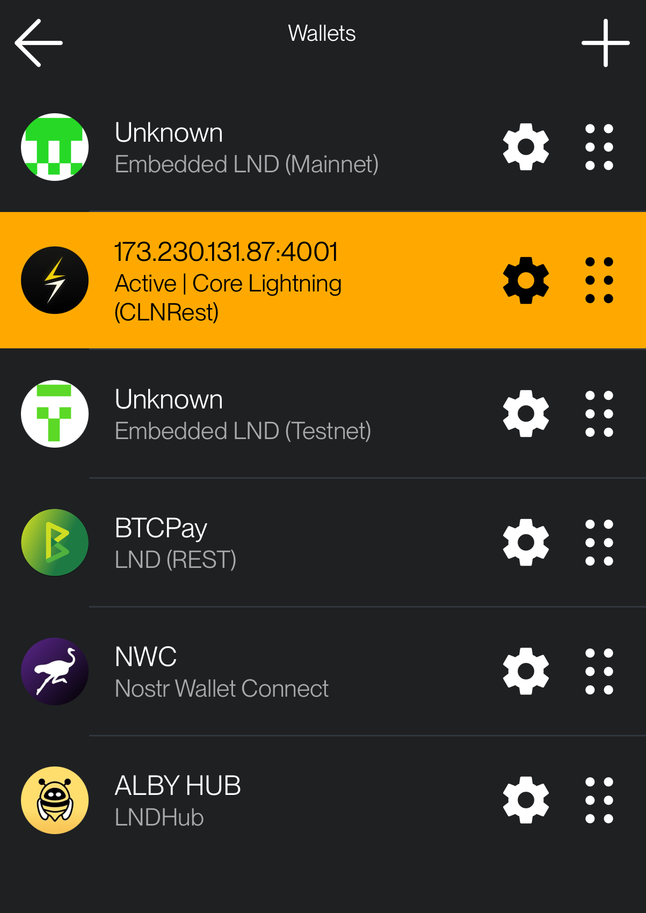

# Wallets  

## Setting Up a Wallet Connection  

To connect to a wallet, tap on **+ Add New Wallet**. You will be redirected to a new screen where you can either **manually enter the connection details** or **scan the node’s QR URI** to autofill the required fields.  

Assign a nickname to your connection for easy identification. Tap on the circle icon next to the nickname to set a custom wallet picture. Then, choose the appropriate **wallet interface** from the available options:  

- **Embedded LND**  
- **LND Rest**  
- **LND (Lightning Node Connect)**  
- **CLNRest**  
- **Nostr Wallet Connect**  
- **LNDHub**  

If your wallet operates on the **Tor network**, ensure that you enable the **Use Tor** option.  

  

---

## Managing Wallet Connections  

Once you've set up multiple **wallet connections**, you can seamlessly switch between them without interference. Each wallet functions independently, whether connected via **Tor, clearnet, Tailscale, or a local IP**. ZEUS will automatically establish the connection without requiring a restart.  

However, if switching from a **clearnet** connection to **Tor**, it may take some time for the Tor network to bootstrap your relays—so a little patience may be needed.  

  

---

## Operations  

1. **Select an existing wallet** by tapping on it. You will be redirected to the main screen while ZEUS establishes the connection.  
2. **Edit an existing wallet** by tapping the **settings icon (⚙️)** next to it. This will open the wallet’s configuration menu, where you can modify the settings or delete the connection.  
3. **Rearrange wallets** by holding and dragging the **drag icon (≡)** next to each wallet. This allows you to change the order of your wallets as per your preference.  
4. **Backup and Restore (Coming Soon):** A future update will allow saving wallet configurations to a file for easy migration to a new device.  