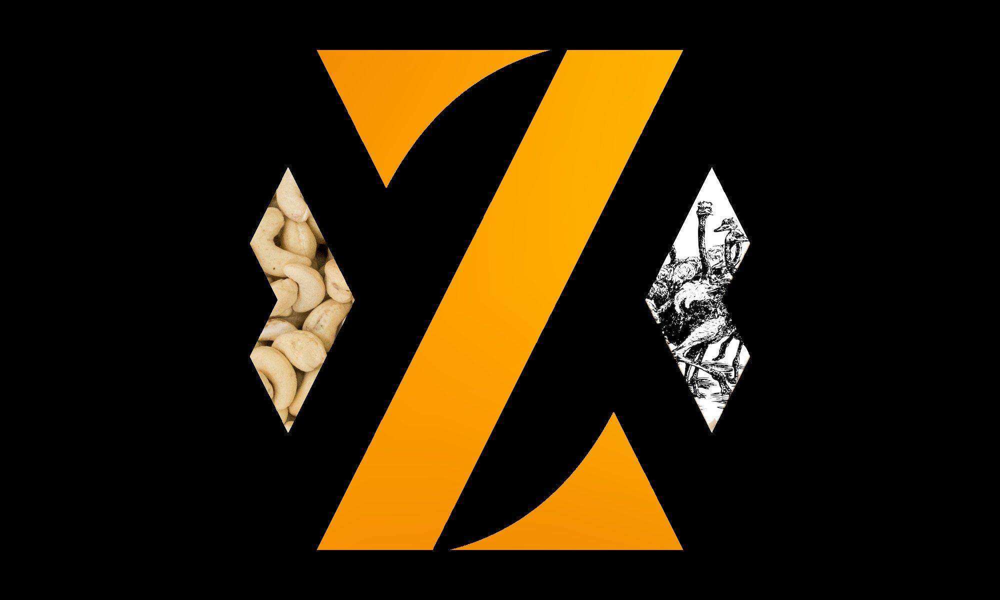

---

---

# Intro

 As of ZEUS v0.11, ZEUS Pay has three different address types:

- [Cashu addresses](./cashu) for newcomers. Pick your mint and start receiving zaps right away.

- [Zaplocker addresses](./zaplocker). The first ever self-custodial Lightning addresses for mobile. We debuted these back in ZEUS v0.8.0.

- [Nostr Wallet Connect (NWC)](./nwc) addresses for remote node runners. Generate invoices directly from your node. No need to redeem.

Now users have options for every step of their Bitcoin journey. You can switch between these three address types under your Lightning address setting all while maintaining the same ZEUS handle.

To create a new ZEUS Pay address, navigate to `Menu` > `Lightning address` in the ZEUS mobile wallet. New ZEUS Pay users will be prompted to choose a Lightning address type based on their active wallet interface.

To switch address types, go to `Menu` > `Lightning address` > `Settings` > `Switch to...`.