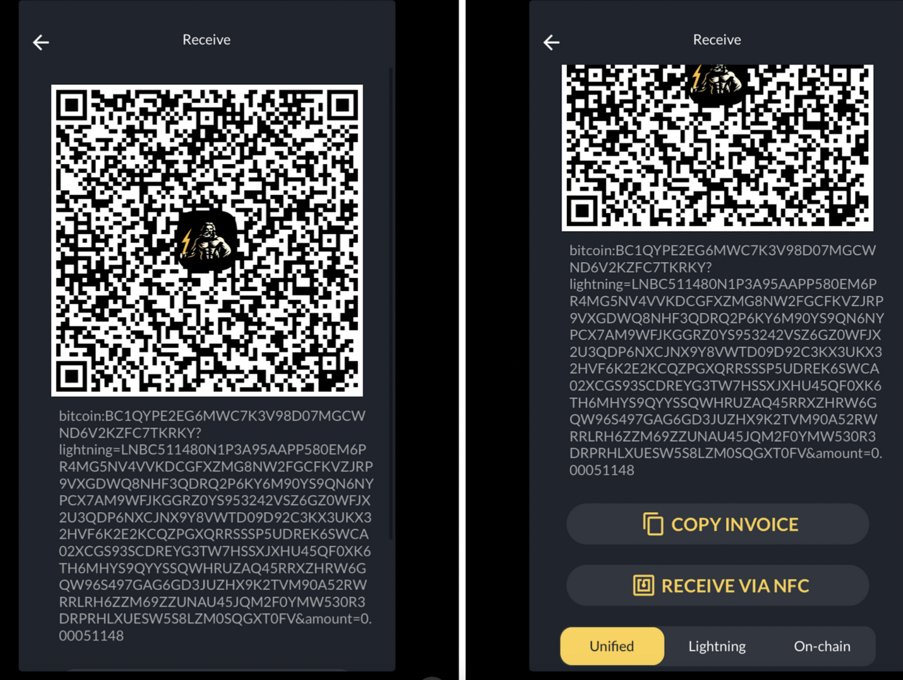

---

---

import pos1 from '../../static/img/pos/pos-1.png';
import pos2 from '../../static/img/pos/pos-2.png';
import pos3 from '../../static/img/pos/pos-3.png';
import pos4 from '../../static/img/pos/pos-4.png';

# Checking out with Zeus POS

*In order to accept bitcoin payments, we will ring up orders on Square just like a typical transaction, but we will use Square’s Other Payments functionality to send bitcoin related payments to Zeus.*

# On the Square Terminal

Step 1: Create and complete tab. Create a tab as you usually would (“New Sale” > add all items). Proceed to the following steps when the tab is complete and the patron is ready to pay.

[*Note: this tutorial assumes you want to reconcile all your tips on the Square Terminal. To do so you must add the tip as a line item on the Square Terminal (like Auto Gratuity) and have the tips disabled in the Zeus POS. To allow customers to set their tips in Zeus and and are OK with reconciling tips afterwards, leave tips enabled in the Zeus POS settings.*]

Step 2: Request gratuity. When the patron says they would like to pay in Bitcoin, ask them what they would like to tip

Step 3: Add gratuity using “Auto Gratuity.” Add the requested tip amount using the “Auto Gratuity” feature on the “New Sale” page. Type in the amount, hit the “+” on the right side of the number pad; this will add the tip amount to the column on the right hand side of the screen. Then hit “Add to check” in the bottom right corner of the screen.

Step 4: Close tab in Square by exporting payment to Zeus. Once Auto Gratuity is added, hit “Pay” on the bottom right of the screen (directly above the blue “Send” button). On the next page, scroll down and hit “More” at the bottom of the menu of options. On the next page, hit “Other Payment Types,” and then type “Zeus” , “BTC” , or “Bitcoin” (case does not matter). This will send the transaction over to Zeus, so your work on the square terminal is done.

# In the Zeus app

Step 5: Open up Zeus App. It is the only app on the leftmost home screen. 

Step 6: Navigate to “Orders” page. The app should default open up to this page, but if it does not, navigate to the home page. Then, hit the calculator icon on the top right of the home page. 

Step 7: Select order. Click the appropriate order. Confirm details. Hit “Pay”

Step 8: Display QR code. Show patron the QR code. If there are issues, it is likely on there end, so some patience might be required while they iterate. If issues persist, scroll to the bottom of the screen, and ask the patron whether they want to pay with “Lightning” or “On-chain.” Depending on their answer, select one of the options at the very bottom of the screen and a new QR code will appear.

Step 9: Confirmation. Once the patron says the payment went through, that’s it! You’re done! The order should appear under the “Paid” tab shortly! 