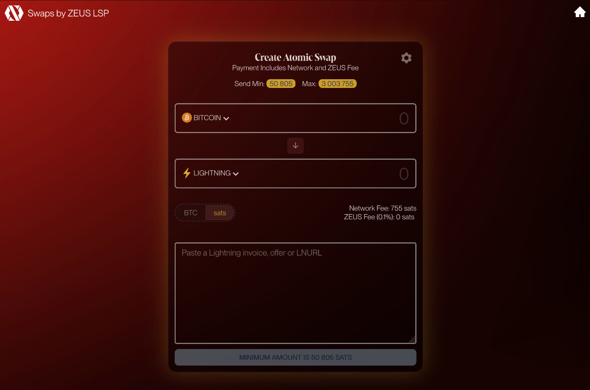

---

---

# Swaps

ZEUS's swap service allows users to swap on-chain funds for Lightning funds, and vice versa, without having to open or close channels. The service leverages submarine swaps that can be performed without custody or counterparty risk. 

The service can be accessed directly in the ZEUS wallet app or via our [swaps web portal](https://swaps.zeuslsp.com).

